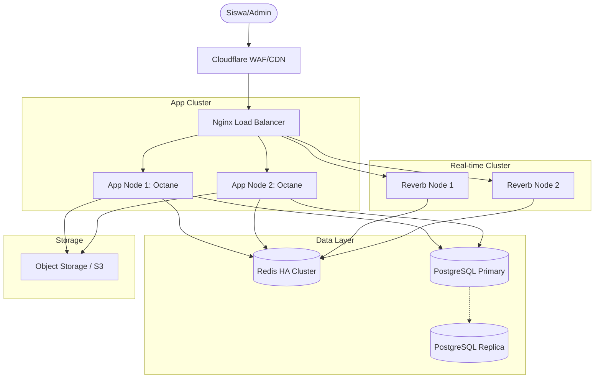

# Production Deployment Guide: Makassar Ujian

Dokumen ini merinci arsitektur infrastruktur dan strategi deployment untuk lingkungan produksi berskala besar.

## 1. Arsitektur Infrastruktur (Multi-Server)

Sistem harus dideploy dengan pemisahan peran untuk skalabilitas dan ketersediaan tinggi (High Availability).

### Spesifikasi Rekomendasi
- **App Nodes**: CPU-Optimized (min 4 vCPU, 8GB RAM).
- **Redis Node**: Memory-Optimized (min 8GB RAM).
- **DB Node**: Storage-Optimized (NVMe SSD).

## 2. Strategi Zero-Downtime Deployment

Menggunakan **Blue-Green Deployment** untuk memastikan ujian tidak terganggu saat update sistem.

1.  **Preparation**: Build Docker image terbaru.
2.  **Deployment**: Deploy ke cluster "Green" (node baru).
3.  **Health Check**: Pastikan "Green" cluster sehat.
4.  **Traffic Switch**: Ubah routing Nginx dari "Blue" ke "Green".
5.  **Graceful Shutdown**: Matikan cluster "Blue" setelah semua koneksi aktif selesai (terutama WebSocket pengerjaan).

## 3. Keamanan Produksi
- **SSL/TLS**: Wajib HTTPS (TLS 1.3).
- **Firewall**: Tutup port 22, 5432, 6379 dari akses publik (hanya internal VPC).
- **Rate Limiting**: Dikonfigurasi di Nginx dan Cloudflare untuk mencegah DDoS.

## 4. Backup & Disaster Recovery
- **Database**:
    - Snapshot harian.
    - Wal-G / Barman untuk Point-in-Time Recovery (PITR).
- **Redis**: Snapshot RDB setiap 1 jam + AOF untuk integritas data.
- **Files**: Semua file soal/gambar disimpan di S3 dengan versioning aktif.
