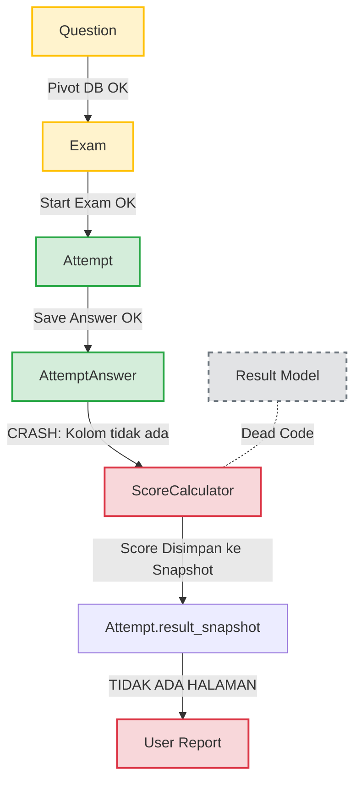

# Laporan Audit Core Exam Engine
> Fokus: Integrasi Backend & Database Flow

Audit ini menelusuri alur hidup sebuah ujian dari penyiapan soal hingga pelaporan nilai, untuk memastikan mesin ujian (Exam Engine) bisa memproses ujian yang nyata (real exam).

## 🗺️ Flowchart Integrasi Saat Ini



---

## 🔍 Hasil Audit per Tahapan

### 1. Question → Exam (🟡 Terhubung dengan BUG Tersembunyi)
- **Status DB:** Terhubung. Tabel pivot `exam_questions` sudah ada dan relasi model (BelongsToMany) sudah dikonfigurasi dengan benar.
- **Masalah Fatal:** Model `Question` menyimpan data soal dan jawaban benar di dalam JSON column `content`. Namun, engine skoring berasumsi ada kolom fisik bernama `correct_option`. Ini adalah *schema mismatch*.

### 2. Exam → Attempt (🟢 Fully Connected)
- **Status:** Berjalan baik.
- **Detail:** Saat siswa memanggil endpoint `/api/exam/start`, sistem berhasil membuat record di tabel `attempts`, menyetel `session_id`, menginisiasi Redis State, dan mengirim data kadaluarsa (expires_at). Proteksi *single-session* (satu user tidak bisa login 2x untuk ujian sama) juga berfungsi.

### 3. Attempt → Answer (🟢 Fully Connected)
- **Status:** Berjalan baik (Sangat Robust).
- **Detail:** Endpoint `/api/exam/save-answer` bekerja sempurna. Ia bisa menyimpan ke Redis (Fast Path) atau langsung ke DB `attempt_answers` (Safe Mode). Job `FlushAttemptAuditBuffer` juga sukses memindahkan data dari Redis ke MySQL tanpa kehilangan data.

### 4. Answer → Result (🔴 PATAH / FATAL ERROR)
- **Status:** Gagal Total (Akan Crash saat Submit).
- **Detail Bug:** Saat `/api/exam/submit` dipanggil, ia menjalankan `ScoreCalculator@calculateAndPersist`.
Di dalam service ini terdapat query:
  ```php
  $questions = $attempt->exam()->questions()
      ->select(['questions.id', 'correct_option']) // <-- SQL ERROR DI SINI
      ->get();
  ```
  Karena kolom `correct_option` tidak ada di MySQL (berada di dalam JSON `content`), proses submit akan selalu menembakkan Exception `Column not found` dan skoring gagal.
- **Dead Code:** Model `Result.php` dan tabel `results` ada, tetapi **tidak pernah dipakai**. Skoring langsung disimpan ke kolom `score` dan `result_snapshot` di tabel `attempts`.

### 5. Result → Report (🔴 Missing UI)
- **Status:** Tidak Terhubung.
- **Detail:** Walaupun seandainya skoring berhasil disimpan ke `result_snapshot`, tidak ada controller atau view yang menarik data tersebut untuk ditampilkan kepada siswa atau admin. Siswa tidak akan pernah tahu nilainya setelah menekan tombol submit.

---

## 🎯 Kesimpulan & Gap Resolution

Core exam engine saat ini **TIDAK BISA** menjalankan ujian nyata sampai bug scoring diperbaiki. 

**Rekomendasi Perbaikan (Urutan Prioritas):**
1. **Fix `ScoreCalculator.php`:** Ubah logic pengambilan jawaban benar. Jangan pakai `select('correct_option')`. Tarik seluruh question, lalu gunakan `$question->correctAnswer()` untuk mengekstrak kunci jawaban dari JSON.
2. **Hapus Dead Code:** Drop tabel `results` dan model `Result.php` agar tidak membingungkan developer selanjutnya, karena sistem sepakat menggunakan `result_snapshot` pada `attempts`.
3. **Bangun Report UI:** Buat halaman `ResultController@show` untuk merender JSON `result_snapshot` menjadi tabel hasil/pembahasan yang bisa dibaca manusia.
