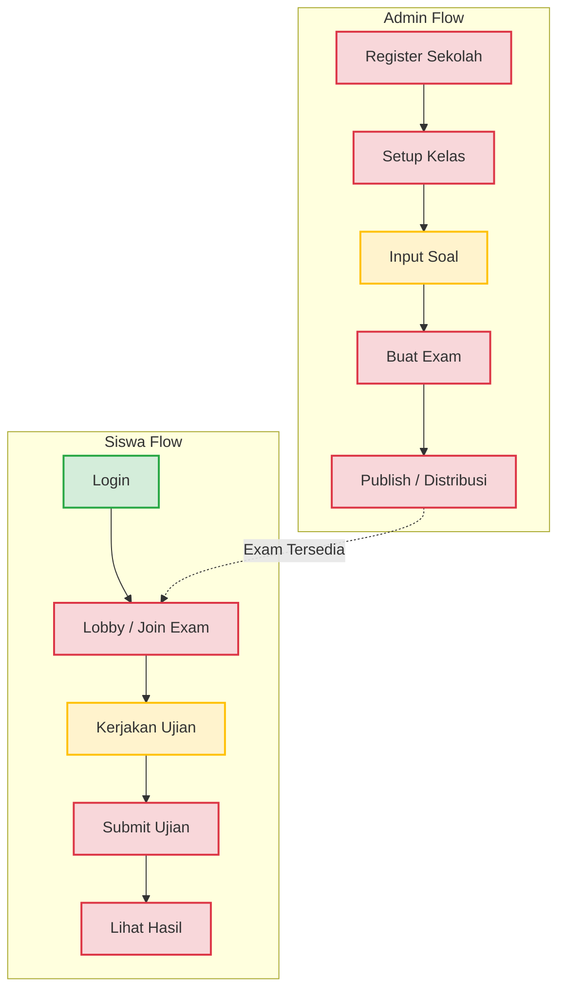

# Laporan Audit User Flow End-to-End
> Fokus: Usability & Functional Completeness

Audit ini mensimulasikan alur kerja pengguna (Admin dan Siswa) dari awal registrasi hingga proses ujian selesai. Tujuannya adalah memetakan titik-titik di mana aplikasi "terputus" atau tidak bisa digunakan.

---

## 🗺️ Diagram Status Alur Pengguna

*(Hijau = Berjalan, Kuning = Partial/Ada Dummy, Merah = Putus/Tidak Ada)*

---

## 🛑 Analisis Bottleneck (Langkah yang Terputus)

### A. Alur Admin (Pembuat Ujian)

1.  **Register Sekolah (🔴 BROKEN)**
    *   **Kondisi:** Halaman form `/register` ada, tetapi tombol submit tidak terhubung ke endpoint mana pun (Tidak ada `RegisteredUserController`).
    *   **Dampak:** Admin sekolah tidak bisa mendaftar mandiri; harus dibuatkan manual oleh Super Admin.
2.  **Setup Kelas (🔴 BROKEN)**
    *   **Kondisi:** Model `Classes` ada di database, tetapi tidak ada UI maupun Controller (tidak ada `ClassController`) untuk Admin membuat/mengatur kelas.
3.  **Input Soal (🟡 PARTIAL)**
    *   **Kondisi:** `QuestionController` (API) sudah ada dan cukup lengkap. Namun integrasi dengan Vue di `bank-soal.blade.php` masih perlu dirapikan.
4.  **Buat Exam (🔴 BROKEN)**
    *   **Kondisi:** **Tidak ada `ExamController`**. Admin tidak memiliki halaman untuk merangkai soal-soal menjadi satu paket ujian.
5.  **Publish / Distribusi (🔴 BROKEN)**
    *   **Kondisi:** Halaman `distribusi.blade.php` hanyalah mockup tabel statis berisi "Data Contoh 1, 2, 3". Admin tidak bisa mendistribusikan ujian ke siswa.

### B. Alur Siswa (Peserta Ujian)

1.  **Login (🟢 OK)**
    *   **Kondisi:** Berjalan mulus. Fitur multi-role mengarahkan siswa ke dashboard yang benar.
2.  **Lobby / Join Exam (🔴 BROKEN)**
    *   **Kondisi:** Di dashboard siswa, list "Ujian Mendatang" adalah hardcoded HTML. Tidak ada tombol atau token input untuk benar-benar masuk (join) ke sesi ujian yang dijadwalkan.
3.  **Kerjakan Ujian (🟡 PARTIAL)**
    *   **Kondisi:** API Engine (`/api/exam/start` dan `/api/exam/save-answer`) sangat tangguh dan bekerja dengan baik menggunakan Redis. **NAMUN**, antarmuka UI di `pengerjaan.blade.php` tidak me-render soal dari database, melainkan menggunakan soal statis hardcoded (*"Apa ibukota Indonesia?"*).
4.  **Submit Ujian (🔴 BROKEN)**
    *   **Kondisi:** Saat siswa menekan Submit, akan terjadi **Fatal SQL Error** karena bug `ScoreCalculator` (mencari kolom `correct_option` yang tidak ada di DB). Sistem akan crash 500.
5.  **Lihat Hasil (🔴 BROKEN)**
    *   **Kondisi:** Setelah ujian selesai (jika bug submit diperbaiki), siswa tidak dialihkan ke mana pun. Tidak ada halaman `ExamResult` untuk menampilkan skor.

---

## 💡 Kesimpulan Usability

Saat ini aplikasi Makassar Ujian berada dalam fase **"UI Shell"**. Backend Engine (infrastruktur Redis, scaling, audit) sudah berada di level *Enterprise/Production-grade*, tetapi "jembatan" yang menghubungkan flow pengguna (Controller & View) sama sekali belum dibangun. 

**Aplikasi ini saat ini belum usable secara fungsional untuk end-user.**

**Rekomendasi Prioritas (To Make It Usable):**
1.  **Bangun Exam Controller:** Buat CRUD untuk Exam agar Admin bisa membuat paket soal.
2.  **Selesaikan UI Pengerjaan Ujian:** Hubungkan Vue/Alpine.js di halaman ujian dengan data soal asli dari `$attempt->exam->questions`.
3.  **Perbaiki Bug Submit:** Selesaikan masalah di `ScoreCalculator`.
4.  **Buat Halaman Hasil:** Beri feedback nilai kepada siswa setelah ujian.
